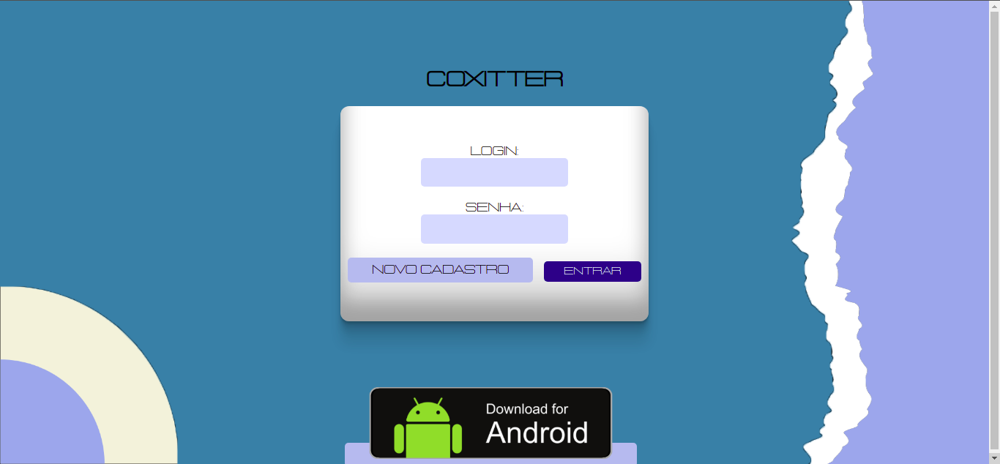

 

<h1 align="center">Aplicativo Kivy para rede social Coxitter</h1>

Trabalho em grupo do último semestre do ensino médio/técnico - Parte kivy

 <a href="#objetivo">Objetivo</a> •
 <a href="#requisitos">Pré-requisitos e run</a> • 
 <a href="#tecnologias">Tecnologias</a> • 
 <a href="#galeria">Galeria</a> • 
 <a href="#autor">Autoria</a>

  
   
   

<h2 id='objetivo'>Objetivo</h2>

A proposta foi construir uma rede social simples no estilo do Twitter, com mensagens de texto públicas, que podem ser curtidas, etc. A nossa rede social se chama Coxitter! Nesse repositório estão nossas telas kv, funcionamento do aplicativo, uso da nossa 
[API Restfull.](github.com/laribrito/API/)

<h2 id='requisitos'> Pré-requisitos e run </h2>

Você tem acesso a internet? Ótimo! Acesse <https://coxitter.just.pro.br/> por qualquer dispositivo e baixe o nosso aplicativo!
 *Obs.: SOMENTE ANDROID*

<h2 id='galeria'>Galeria</h2>

  **Tela de login**

<h2 id='tecnologias'>Tecnologias</h2>

As seguintes ferramentas foram usadas no projeto:

- [Kivy 2.0.0](https://kivy.org/#home)
- [Python 3.6.9](https://www.python.org/)

<h2 id='autor'> A Equipe </h2>

<table>
<tr>
<td>
<a href="https://github.com/laribrito">

 
<b>Larissa Brito</b>
 
</a>

</td>
    
<td>
<a href="https://github.com/kkkaxus">

 
<b>Cassius Santos</b>
 
</a>

</td>
  
<td>
<a href="https://github.com/LastKoala7">

 
<b>Robson Tiago</b>
 
</a>

</td>
  
<td>

 
<b>Victor Santos</b>
 
</a>
</td>
    
</tr>
</table>
